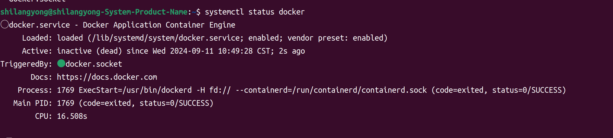

# 🐧 TongSim Ubuntu 平台安装与运行指南（Docker 版）

!!! danger "⚠️ 重要：本仓库为 **比赛专用精简版**（请先阅读）"
    **TongSim（本次开源）仅供比赛使用，功能经过大幅裁剪。**

    - 安装**比赛版本 TongSim**请转到 **比赛 Env 仓库文档**：[`Env Docs`](https://github.com/bigai-ai/tongsim-indoor-nav-env)。
    - 下方出现的**安装方法**描述的是**院内完整版本 TongSim**的安装逻辑，供参考；如需体验**完整版本**，请联系内部人员。
    - 本次比赛发布版本为**专用精简版**的构建：大量**传感、交互、资产、动作**等功能未包含；

欢迎使用 **TongSim Docker 版本**！本指南帮助你在 Ubuntu 平台完成安装、配置并顺利运行 TongSim。我们针对新手用户，逐步介绍操作含义与背景。

---

## 🚀 安装 Docker 与 NVIDIA Container Toolkit

### 准备工作: 更新系统并安装基础工具

运行以下命令，更新软件包索引并安装必要工具（支持 HTTPS、仓库管理等）:

```
sudo apt update && \
sudo apt install -y apt-transport-https ca-certificates curl software-properties-common
```
💡 **说明**: 确保系统软件信息是最新状态，并安装支持安全下载及仓库管理的组件。

---

### 配置 Docker 官方仓库（使用阿里云加速）

添加 GPG 密钥并配置阿里云 Docker 仓库:

```
curl -fsSL https://mirrors.aliyun.com/docker-ce/linux/ubuntu/gpg | sudo apt-key add -
sudo add-apt-repository "deb [arch=amd64] https://mirrors.aliyun.com/docker-ce/linux/ubuntu $(lsb_release -cs) stable"
```
💡 **说明**: 导入 Docker 签名，保证软件包安全；添加仓库地址，从阿里云镜像加速下载。

---

### 安装 Docker 并配置权限

安装 Docker 及相关组件，并配置当前用户可免 sudo 运行:

```
sudo apt update && \
sudo apt install -y docker-ce docker-ce-cli containerd.io docker-compose-plugin && \
```
💡 **说明**: 安装 Docker 社区版
??? tip "安装完成后，可以通过如下方式查看安装是否正确"
    - 控制台执行`sudo systemctl status docker`
        


```
sudo systemctl start docker
sudo systemctl enable docker
sudo groupadd docker
sudo gpasswd -a $USER docker
newgrp docker
```
💡 **说明**:  启动 Docker 服务, 配置当前用户加入 `docker` 组，无需 sudo 即可操作 docker

---

### 安装 NVIDIA Container Toolkit（启用 GPU）

```
curl -fsSL https://mirrors.ustc.edu.cn/libnvidia-container/gpgkey | \
    sudo gpg --dearmor -o /usr/share/keyrings/nvidia-container-toolkit-keyring.gpg
curl -s -L https://mirrors.ustc.edu.cn/libnvidia-container/stable/deb/nvidia-container-toolkit.list | \
    sed 's#deb https://nvidia.github.io#deb [signed-by=/usr/share/keyrings/nvidia-container-toolkit-keyring.gpg] https://mirrors.ustc.edu.cn#g' | \
    sudo tee /etc/apt/sources.list.d/nvidia-container-toolkit.list
sudo apt update
sudo apt install -y nvidia-container-toolkit
sudo systemctl restart docker
```
💡 **说明**: 添加 NVIDIA 容器工具包源，用于容器中调用 GPU。 (下载GPG密钥并配置APT源), 安装工具包后重启 Docker 生效。

---

## 🐳 获取并运行 TongSim 镜像

### 登录通研院内私有仓库

```
docker login harbor.mybigai.ac.cn
```
💡 **说明**: 输入与 IDAP 一致的用户名和密码，授权从私有仓库下载镜像。

---

### 拉取镜像

```
docker pull harbor.mybigai.ac.cn/tongsim/tongai
```
💡 **说明**: 下载最新 TongSim 镜像到本地。

---

### 启用图形界面支持（X11）

```
xhost +
```
💡 **说明**: 允许容器访问宿主机 X11，用于显示 GUI 窗口。

---

### 启动容器

```
docker run -ti --gpus=all --rm --entrypoint=bash \
  -e DISPLAY=$DISPLAY --net=host --device /dev/snd \
  -v /tmp/.X11-unix:/tmp/.X11-unix:rw \
  harbor.mybigai.ac.cn/tongsim/tongai
```
#### 💡 **主要参数说明**:
| 参数 | 含义 |
|-------|-------|
| `--gpus=all` | 启用全部 GPU 设备 |
| `--rm` | 容器退出后自动删除 |
| `--entrypoint=bash` | 进入 bash 终端而非默认入口 |
| `-e DISPLAY=$DISPLAY` | 共享宿主机显示环境变量 |
| `--net=host` | 使用宿主机网络 |
| `--device /dev/snd` | 允许容器访问音频设备 |
| `-v /tmp/.X11-unix:/tmp/.X11-unix:rw` | 挂载 X11 通信 socket，支持 GUI 窗口显示 |

---

### 启动 TongSim 应用

在容器中执行:

```
./run_local.sh
```
💡 **说明**: 以本地模式启动 TongSim。


若需推流到媒体中心:
```
./run_local_mediacenter.sh
```
💡 **说明**: 启动 TongSim 并推流。

---

## ⚠️ 注意事项

!!! warning "重要提示"
    - 确保宿主机已正确安装 NVIDIA 驱动并可正常运行 `nvidia-smi`。
    - 建议首次拉取镜像后测试 GUI 界面显示功能（例如简单的 X11 窗口程序）。
    - 注意保证终端 `xhost +`

---

## 📌 常用指令速查

| 操作 | 命令 |
|-------|-------|
| 查看 Docker 状态 | `sudo systemctl status docker` |
| 启动 Docker 服务 | `sudo systemctl start docker` |
| 设置 Docker 开机启动 | `sudo systemctl enable docker` |
| 查看本地镜像列表 | `docker images` |
| 查看正在运行的容器 | `docker ps` |
