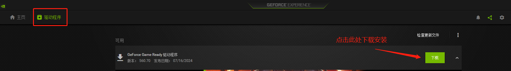
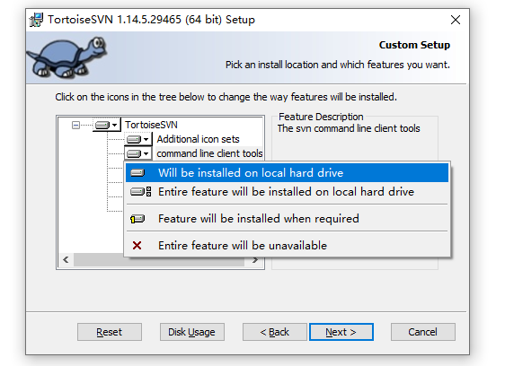
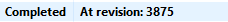
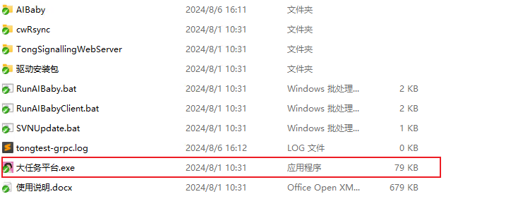
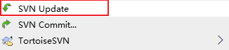
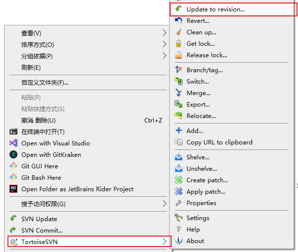
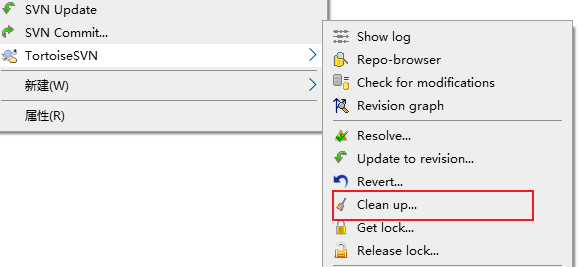

# TongSim 客户端 安装指南（Windows 平台）

!!! danger "⚠️ 重要：本仓库为 **比赛专用精简版**（请先阅读）"
    **TongSim（本次开源）仅供比赛使用，功能经过大幅裁剪。**

    - 安装**比赛版本 TongSim**请转到 **比赛 Env 仓库文档**：[`Env Docs`](https://github.com/bigai-ai/tongsim-indoor-nav-env)。
    - 下方出现的**安装方法**描述的是**院内完整版本 TongSim**的安装逻辑，供参考；如需体验**完整版本**，请联系内部人员。
    - 本次比赛发布版本为**专用精简版**的构建：大量**传感、交互、资产、动作**等功能未包含；

> 💻 **推荐配置**
>
> - 显卡: NVIDIA RTX 3070 或更高（40 系列最佳）
> - 硬盘: 剩余空间 ≥ 100 GB

---

## 🚀 显卡驱动安装

1️⃣ 安装 [NVIDIA GeForce Experience](https://www.nvidia.cn/geforce/geforce-experience/)。
2️⃣ 通过 GeForce Experience 下载并安装最新显卡驱动。



---

## 🛠 安装 SVN 工具

1️⃣ 下载并安装 [TortoiseSVN](https://tortoisesvn.net/)。
2️⃣ 安装过程中 **务必勾选 `command line client tools`**。



---

## 📦 获取 TongSim

1️⃣ 在目标目录（路径 **不含中文**）右键选择 **SVN Checkout**。
2️⃣ 填写仓库地址:
```
http://svn.mybigai.ac.cn:18080/svn/Demo/trunk/AIBabyUE5Client
```
3️⃣ 成功拉取后目录示例:



4️⃣ 启动程序: 双击 `大任务平台TongSim.exe`。（首次运行会提示安装一些缺失的 C++ 运行库）



---

## 🔄 更新 TongSim

1️⃣ 在项目目录右键选择 **SVN Update**，拉取最新版本。



2️⃣ 切换指定版本:
右键选择 **SVN Update to revision**，输入 revision 编号或点击 **Show Log** 选择版本。



---

## ❓ 常见问题（FAQ）

??? tip "SVN 操作出现错误"
    - 若目录锁定或出错，右键选择 **SVN Clean Up**。

      

    - 如果提示权限问题，请通过任务管理器检查是否有其他进程占用 SVN 目录或文件。

??? tip "安装后客户端启动报错"
    - 推荐进入答疑群，安装公告中的 DXRepair 工具，运行自检 显卡驱动、 DirectX 和 MSVC++ 库的环境情况。
