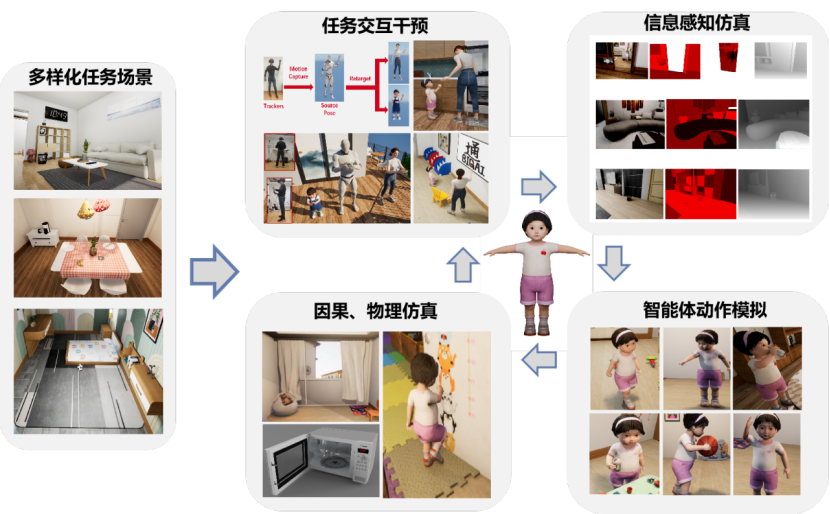

# TongSim

**TongSim** 是一个基于虚幻引擎构建的通用智能体仿真与训练平台。它为通用人工智能（AGI）智能体提供多样化的任务场景，并赋予智能体感知外部世界的能力，如视觉、听觉和触觉。智能体通过感知这些信息，结合自身的状态、能力和价值因素，做出相应的决策。

仿真平台还提供了智能体执行动作的能力，使其能够与外部环境进行交互。每当智能体对环境进行操作后，平台会在因果关系和物理法则的基础上，模拟环境状态的变化。此外，TongSim 还支持 VR 交互，可以将现实世界中的人类动作或其他智能体的行为映射到虚拟环境中，对智能体的外部环境进行干预。

## 竞赛精简版说明（**务必阅读**）

> 目前开源的是面向 **“第一届产学结合高校通用人工智能大赛（The 1st Industry–University AGI Competition）”** 的精简版 TongSim 平台与 SDK 文档首页（MkDocs）。
> 本仓库仅提供**比赛使用所需的最小能力集合**的服务端与配套 SDK。

为降低上手门槛、聚焦大赛任务目标，本次大赛发布的 **TongSim Unreal** 为**整体功能精简版**：

- **仅包含**：面向 **RL 训练的基础移动能力** 与所需的最小场景与资产（如：基础定位/移动、姿态与简单交互接口）。
- **不包含**：完整版中的高级能力（丰富的传感器、复杂交互、、动作技能库、广泛的场景资产、系统级评测工具链等）。
- **SDK 接口可见但可能不可用**：出于工程一致性，SDK 仍保留了对接完整平台的**全量接口定义**。在精简版服务端中，部分接口会返回 `UnkownMethod`、`Can not found GrpcSubject` 等状态，这是**预期行为**。

若对**完整版 TongSim**（含更丰富的传感、物理、交互与评测能力）感兴趣，可以联系：wukunlun@bigai.ai
